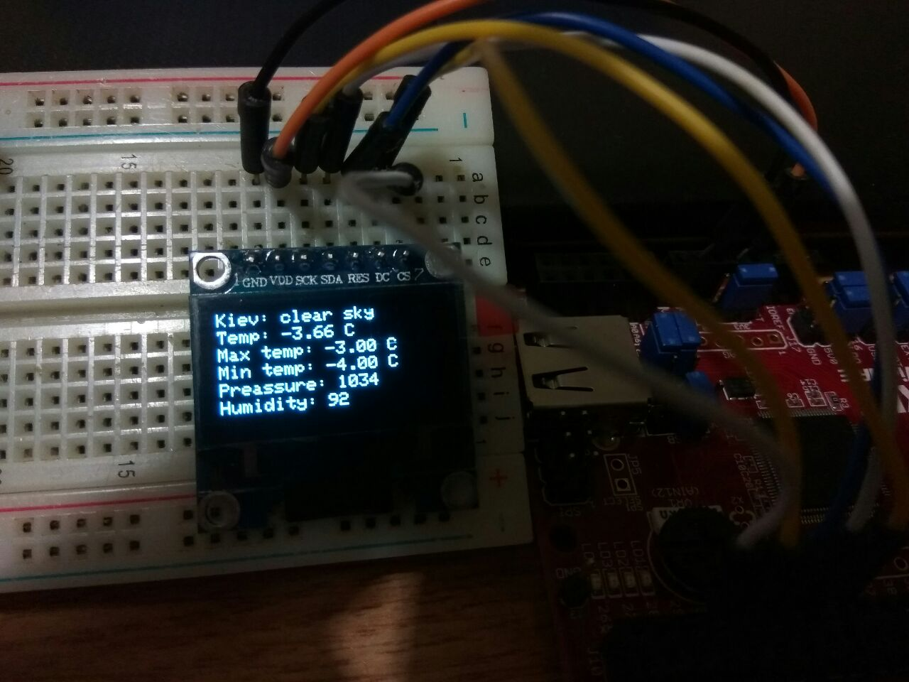

# Weather monitor gadget

IoT device for displaying current weather in you city using chipKit Wi-Fire board. It connects to your WiFi network and sending GET requests to [openweathermap.org](https://openweathermap.org/) weather service to get actual weather in choosed location.
There is a guide how to use api of this service: [openweathermap.org/current#format](https://openweathermap.org/current#format).

The chipKit board is setted up to program it with Arduino IDE. There is a video guide which explains how to do this: [youtube.com/watch?v=DOEdmc57FVU](https://www.youtube.com/watch?v=DOEdmc57FVU).

To compile the sketch you need to install a few additional libraries: Adafruit_SSD1306 and ArduinoJson. You can do it from library manager in Arduino IDE. Adafruit_SSD1306 library is used for driving OLED display with SSD1306 driver and ArduinoJson library is used to parse JSON from weather service.

